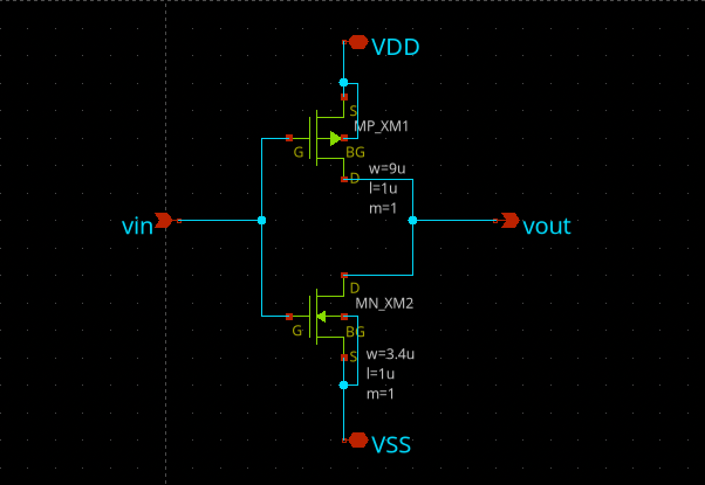
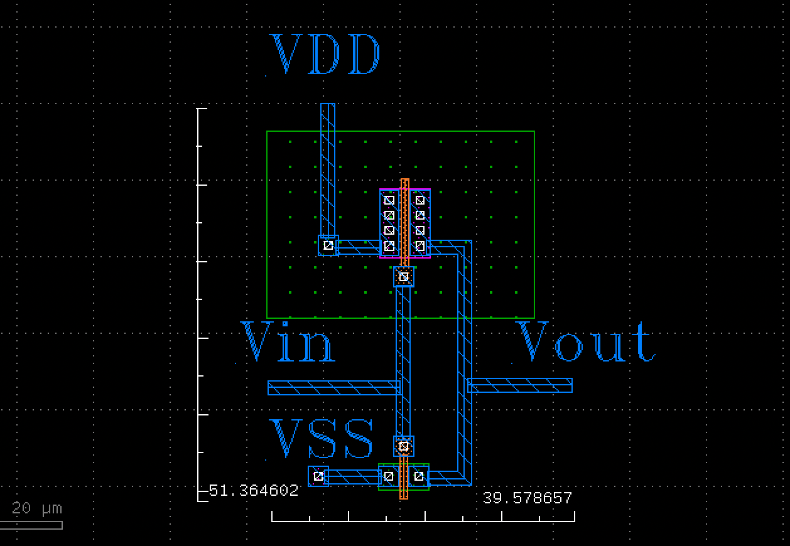
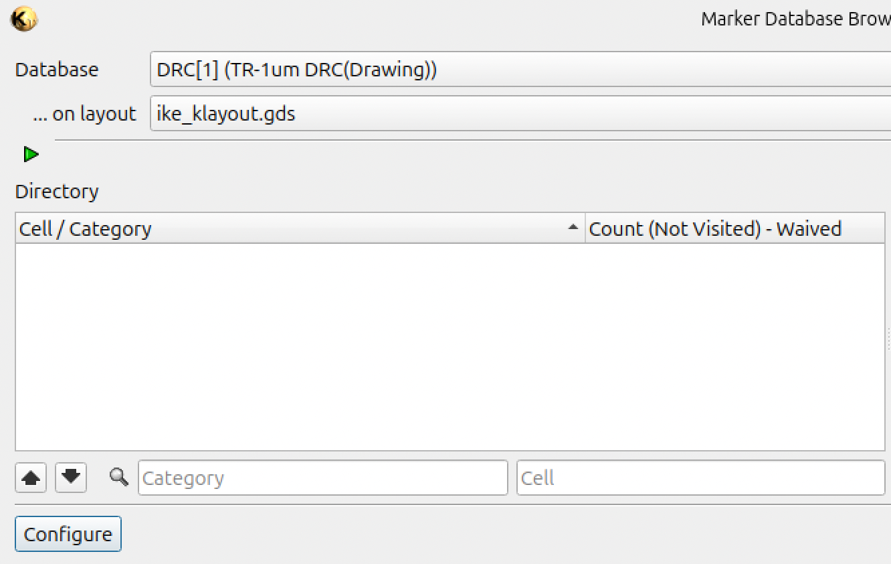
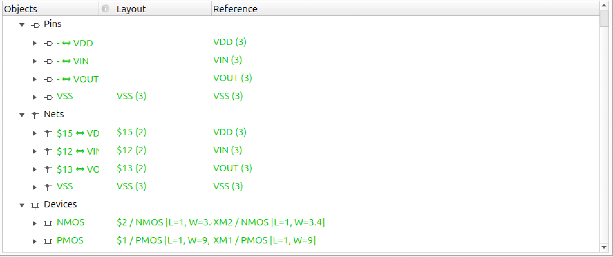

# CMOS Inverter IC Design

A CMOS inverter designed and laid out as my first IC design project.

The project covers the basic IC design flow from schematic capture to physical layout and GDS generation. The design is currently proceeding toward tapeout.

  
  

## Project Overview

- Circuit: CMOS inverter
- Design flow: Schematic → Layout → GDS
- Tools: xschem, KLayout
- Output: Schematic and GDS
- Status: Proceeding toward tapeout
- Date: July 2026

## Motivation

My background is primarily in embedded systems and PCB-level hardware development. I started this project to gain hands-on experience with transistor-level circuit design and physical IC layout.

Through this project, I learned how concepts I was familiar with from PCB design, such as connectivity, layout constraints, and physical implementation, translate to the IC level.

## Schematic

The inverter consists of a complementary PMOS/NMOS pair.

## Layout

The physical layout was created in KLayout and exported as GDS.

## Verification

The layout was checked using DRC and LVS before tapeout.

### DRC

  

No errors.

### LVS

  

All Green.

## Current Status

The design is proceeding toward tapeout with support from the ISHI-Kai semiconductor community in Japan.

Tapeout is expected to be completed this winter.

This is my first IC design project, and I am continuing to build experience in analog and mixed-signal IC design.

## Files

- `cmos_inverter.sch` — schematic
- `cmos_inverter.gds` — physical layout / GDS
